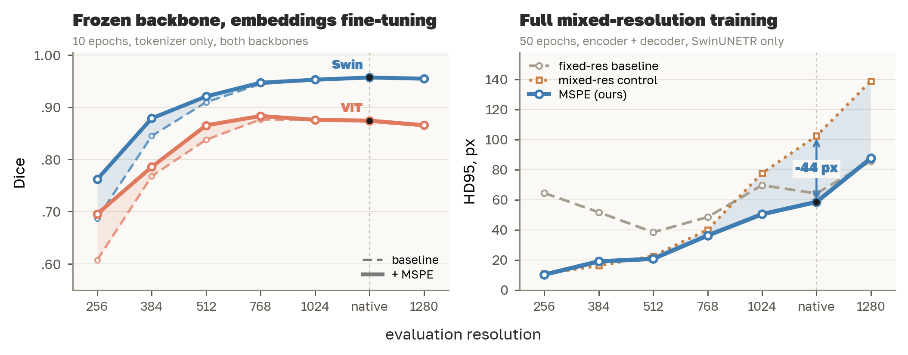
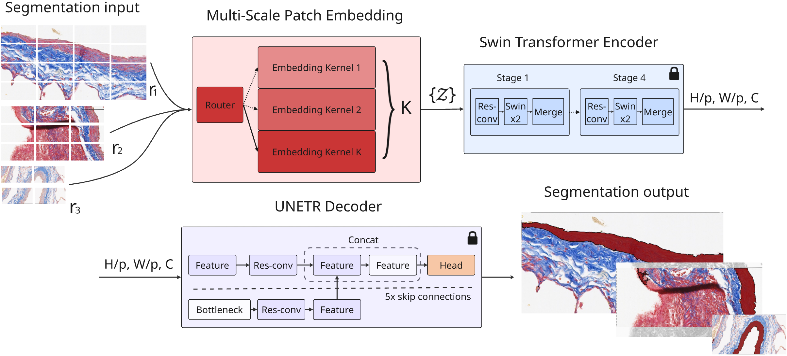
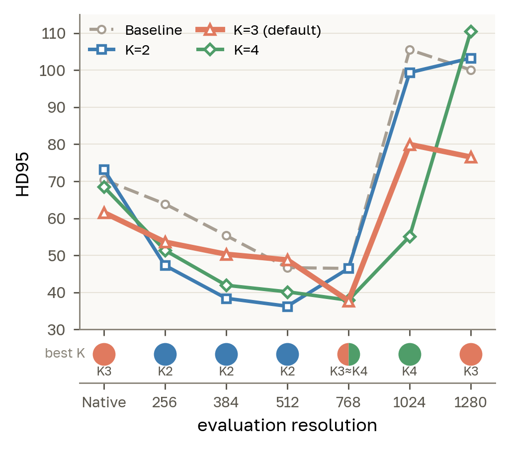
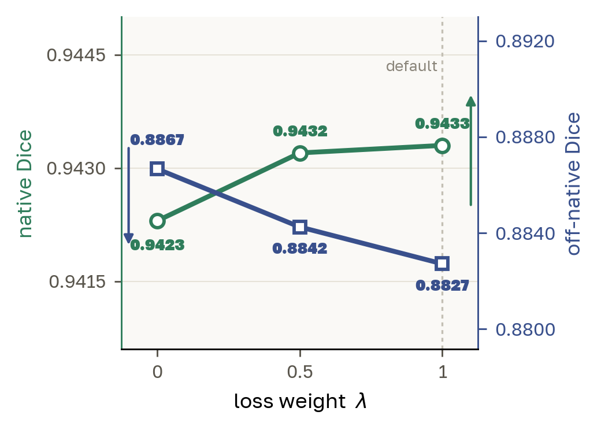
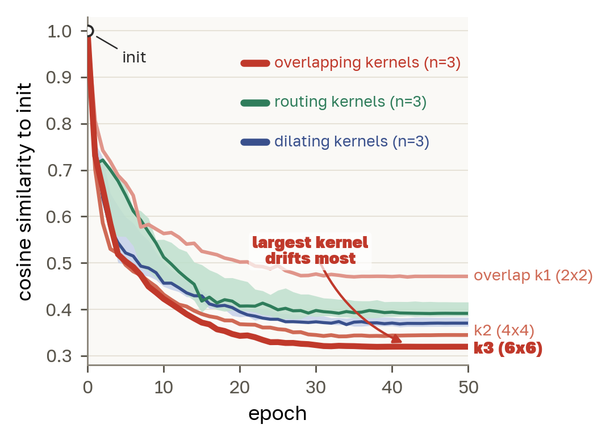

# MSPE-Swin: Multi-Scale Patch Embedding for Robust SwinUNETR

[](LICENSE)
[](https://www.python.org/)
[](https://pytorch.org/)
[](https://monai.io/)

Official implementation of *MSPE-Swin: Multi-Scale Patch Embedding For Robust SwinUNETR*.

Although the Swin backbone performs strongly on both medical and natural images, it still degrades
when evaluated at different evaluation resolutions. On vascular histology, for instance, Dice drops from 0.95
at native resolution to 0.69 at 256 px. In this work we adapt Multi-Scale Patch Embedding (MSPE) to
SwinUNETR: we replace only the patch embedding layer with a small set of resolution specific
patch kernels, leaving the encoder, the skip connections, and the decoder unchanged. The approach
is therefore fully compatible with pretrained weights, and a fixed-resolution model can be
converted into a multi-resolution one in 10 epochs with the backbone frozen.

We additionally release [`MSPE/vit_mspe.py`](MSPE/vit_mspe.py), a reimplementation of the original
MSPE for plain ViT ([Liu et al., NeurIPS 2024](https://arxiv.org/abs/2405.18240)), which was
published without code.



**Left:** training only the patch embedding on a frozen backbone recovers Dice on ViT-UNETR
(+0.088 at 256) and SwinUNETR (+0.075 at 256), at no cost to native accuracy.
**Right:** under full mixed-resolution training, boundary accuracy (HD95) is what the multi-scale
kernels buy. Pulmonary-vessel histology dataset, 5-fold cross-validation.

## Key idea

Swin transforms an input into a sequence of tokens by a patch embedding layer, implemented in
practice as a convolution which kernel size equals both the stride and the patch size `p` (we use
`p=2` by default). Since both the kernel and the patch grid are fixed at training time, the
tokenizer embeds inputs with a different receptive field whenever those inputs are resized, which
shifts the features and degrades segmentation quality. 

MSPE-Swin substitutes that single kernel with a set of `K` resolution specific kernels.



We divide the target resolution range (`R = {256, 384, 512, 768, 1024, 1280}` for histology) into
`K` bands and assign one kernel per band. At inference we compute the effective (geometric mean)
resolution `r_eff` of the image dimensions. The value in `R` nearest to `r_eff` selects the band,
whose index `i_res` maps to a kernel index `k = min(⌊i_res·K/|R|⌋, K−1)`. A router
processes each input to the selected kernel, which embeds it without any image resizing. The
resulting tokens are `H/p × W/p × C` regardless of which kernel produced them, so the Swin encoder
and the UNETR decoder never receive a shape they were not trained on. The lock icons indicate the
modules that is left untouched.

We explore three ways of improving the vanilla patch embedding, each based on an established line
of work:

| Variant | Design | Class in [`MSPE/swin_mspe.py`](MSPE/swin_mspe.py) |
|---|---|---|
| **Naive routing** | The `K` kernels share the vanilla kernel size and stride `p` and differ only in weights. This design isolates the effect of resolution routing. | `MSPEPatchEmbedSwinNaiveRouting` |
| **Overlapping** | The `k`-th kernel uses size `p(k+1)` with stride `p`, so higher resolutions use progressively larger overlapping receptive fields, following [MViT](https://arxiv.org/abs/2104.11227). | `MSPEPatchEmbedSwinOverlapping` |
| **Dilated** | The `k`-th kernel uses size `p+1` with dilation `k+1` and stride `p`, extending the receptive field by atrous sampling without adding parameters ([dilated convolution](https://arxiv.org/abs/1511.07122)). | `MSPEPatchEmbedSwinDilatingK3` |

MSPE uses `K=3` kernels with patch size `p=2`. Both 2D and 3D inputs are
supported through `spatial_dims`.

**Parameter cost.** Because MSPE modifies only the embedding, it contributes a minimal number of
additional parameters: the Swin patch embedding grows from 0.31K to 0.94K parameters, embedding
FLOPs are practically unchanged, and the total model remains at 7.18M. MSPE therefore contributes for
under 1% of the weights.

MSPE-Swin supports two training regimes, both of which leave the original architecture unchanged
except for the patch embedding layer:

- **Frozen-backbone fine-tuning** (recommended). We freeze the encoder, the skip connections, and
  the decoder, warm-start each kernel from the pretrained `2×2` embedding, and update only the
  kernels for 10 epochs.
- **Full mixed-resolution training.** We optimize the whole model jointly under the
  multi-resolution objective.

---

## Results

Full numbers across all six resolutions  are reported in
the paper.

**Frozen backbone, patch embedding only.** Pulmonary-vessel histology, Dice, 5-fold mean:

| Method | Native | 256 | 384 | 512 |
|---|---|---|---|---|
| SwinUNETR V2 | **.9570** | .6870 | .8450 | .9096 |
| MSPE (Routing) | .9570 | **.7622** | **.8788** | **.9208** |
| ViT-UNETR | .8723 | .6078 | .7680 | .8378 |
| MSPE (ViT) | **.8744** | **.6958** | **.7857** | **.8654** |

Even under such constraints, MSPE recovers a large part of the low resolution gap from the
baseline while still matching it at high resolutions. Native performance is preserved on both
backbones (Swin `p=0.95`, ViT `p=0.21`, two-sided paired *t*-test over the five folds), and both
recover significantly at 256 (Swin `+.075, p=.0001`; ViT `+.088, p=.004`). The same behavior
therefore applies to the ViT-UNETR backbone, which indicates that the approach is not specific to
Swin. 

**Full mixed-resolution training.** Dice and HD95:

| Method | Dice native | Dice 256 | HD95 native | HD95 256 |
|---|---|---|---|---|
| SwinUNETR V2 (fixed-res) | .9483 | .6936 | 64.2 | 64.5 |
| SwinUNETR V2 (mixed-res control) | .9409 | .9412 | 102.5 | 10.8 |
| MSPE (Routing) | **.9499** | **.9453** | **58.5** | 10.2 |

The method also generalizes to 3D cardiac MR (HVSMR-2.0) and to natural images (ADE20K).

---

## Installation

```bash
git clone https://github.com/Digiratory/SwinUNETR-MSPE.git
cd SwinUNETR-MSPE
pip install -e .
```

---

## Quick start

### Convert a pretrained SwinUNETR into a multi-resolution model

The patch embedding is replaced in place, and each of the `K` kernels is warm-started from the
pretrained baseline through the pseudo-inverse resize of [FlexiViT](https://arxiv.org/abs/2212.08013),
which is better starting point than random initialization.

```python
import torch
from monai.networks.nets import SwinUNETR
from MSPE import MSPEPatchEmbedSwinNaiveRouting, pi_resize, DEFAULT_RESOLUTIONS

state = torch.load("best_metric_BASELINE_SWIN_V2_FOLD_0.pth", weights_only=True)

model = SwinUNETR(in_channels=3, out_channels=2, feature_size=24, spatial_dims=2, use_v2=True)
model.load_state_dict(
    {k: v for k, v in state.items() if not k.startswith("swinViT.patch_embed.")}, strict=False
)

model.swinViT.patch_embed = MSPEPatchEmbedSwinNaiveRouting(
    patch_size=2, in_chans=3, embed_dim=24,
    spatial_dims=2, K=3, resolutions=DEFAULT_RESOLUTIONS,
)

w, b = state["swinViT.patch_embed.proj.weight"], state["swinViT.patch_embed.proj.bias"]
with torch.no_grad():
    for conv in model.swinViT.patch_embed.patch_kernels:
        k_size = tuple(conv.weight.shape[2:])
        conv.weight.copy_(w if k_size == tuple(w.shape[2:]) else pi_resize(w, list(k_size)))
        conv.bias.copy_(b)

logits = model(torch.randn(1, 3, 384, 512))   # any input resolution
```

### Fine-tune the embedding on a frozen backbone

We recommended this regime, since it turns a fixed-resolution model into a
multi-resolution one in 10 epochs while updating under 1% of the parameters.

```python
from monai.losses import DiceLoss
from MSPE import mspe_swin_train_step

for p in model.parameters():
    p.requires_grad = False
for p in model.swinViT.patch_embed.parameters():
    p.requires_grad = True

opt = torch.optim.AdamW(model.swinViT.patch_embed.parameters(), lr=1e-3, weight_decay=1e-5)
loss_fn = DiceLoss(to_onehot_y=True, softmax=True)

for img, label in train_loader:
    loss = mspe_swin_train_step(model, img, label, loss_fn, lam=1.0)
    loss.backward(); opt.step(); opt.zero_grad()
```

`mspe_swin_train_step` implements the mixed-resolution objective of Eq. 3. For each batch it picks
one target resolution per kernel, resizes the image, the label, and the ROI mask with aspect ratio
preservation, routes each input to the kernel responsible for it. The 3D case is identical.

## Repository layout

```
MSPE/
├── __init__.py
├── swin_mspe.py               # MSPE for SwinUNETR, 2D and 3D, all three variants
└── vit_mspe.py                # MSPE for ViT/UNETR, our reimplementation of Liu et al.

NOTEBOOKS/
├── VESSELS/                   # pulmonary-vessel histology, the main benchmark
│   ├── MSPE-SWIN/
│   │   ├── FULL_TRAINING/     # Tables 2 and 6
│   │   ├── FINE_TUNING/       # Table 1, Swin (5 folds)
│   │   └── ABLATION/          # Figure 3 (a) K, (b) lambda, (c) kernel drift
│   └── MSPE-VIT/              # Table 1, ViT rows and full-training UNETR
├── HVSMR/                     # 3D cardiac MR, Table 5
└── ADE20K/                    # natural images, Table 4
```

---

## Datasets

We evaluate the proposed method on three publicly available datasets, which cover different
dimensionality, native resolutions, and image sources.

| Dataset | Task | Size | Source |
|---|---|---|---|
| **Pulmonary vessels** (histology) | vascular wall segmentation | 705 images, 0.252 µm/px | [figshare 10.6084/m9.figshare.31386748](https://doi.org/10.6084/m9.figshare.31386748) |
| **ADE20K** | 150-class scene parsing | 20,210 train / 2,000 val | [MIT scene parsing](https://groups.csail.mit.edu/vision/datasets/ADE20K/) |
| **HVSMR-2.0** | 3D whole-heart segmentation | 60 CMR scans | [Pace et al. 2024](https://doi.org/10.1038/s41597-024-03469-9) |

The datasets should be obtained from the sources above.
Our main benchmark is the pulmonary-vessel histology dataset, since fine vascular details are
precisely what low-resolution resampling destroys. 

---

## Model zoo

All checkpoints are on Zenodo under
**[DOI: 10.5281/zenodo.21526768](https://doi.org/10.5281/zenodo.21526768)**, grouped into one
archive per dataset and training regime:

```
vessels_{full_training,fine_tuning,fine_tuning_vit,full_training_unetr,ablation}.zip
hvsmr_{full_training,fine_tuning}.zip
ade20k_{full_training,fine_tuning}.zip
```

Each archive unpacks to a directory of the same name. The tables below give the contents of
each one, the folder column names the archive without `.zip` suffix.

### Pulmonary vessels, 59 checkpoints, 2.5 GB

| Folder | Files | Paper |
|---|---|---|
| `full_training/` | `best_metric_{BASELINE_SWIN_V2,ROUTING_SWIN,OVERLAPPING_SWIN,DIALATING_SWIN,SWIN_MIXED_V2}_FOLD_{0..4}.pth` | Tables 2, 6 |
| `fine_tuning/` | `best_metric_FT_{ROUTING,OVERLAPPING,DILATING}_FOLD_{0..4}.pth` | Table 1, Swin |
| `fine_tuning_vit/` | `best_metric_FT_MSPE_VIT_FOLD_{0..4}.pth` | Table 1, ViT |
| `full_training_unetr/` | `best_metric_VANILLA_UNETR_FOLD_{0..4}.pth` | Table 1, ViT baseline |
| `ablation/` | `FT_ROUTING_K{2,3,4}`, `FT_ROUTING_LAM{00,05,10}`, 3 drift checkpoints, all fold 0 | Figure 3 |

`BASELINE_SWIN_V2` serves both as the Table 1 baseline row and as the warm-start source for every
Swin fine-tuning run; `VANILLA_UNETR` plays the same double role for ViT.

### HVSMR-2.0, 19 checkpoints, 5.4 GB

| Folder | Files |
|---|---|
| `full_training/` | `best_metric_BASELINE_SWIN_V2_fold{0..4}_A1.pth` |
| `fine_tuning/` | `best_metric_FT_{ROUTING,OVERLAPPING}_fold{0..4}_A1.pth`, `best_metric_FT_DILATING_fold{0..3}_A1.pth` |


### ADE20K, 4 checkpoints, 1.6 GB

`best_metric_BASELINE_SWIN_V1_P4_R2.pth` and `best_metric_FT_{ROUTING,OVERLAPPING,DILATING}_P4_R2.pth`,
where `P4` denotes patch size 4 and `R2` retraining round 2, which is what Table 4 reports. 

---

## Reproducing the paper

| Paper item | Notebook | Checkpoints |
|---|---|---|
| Table 1, frozen-backbone fine-tuning, Swin | [`FINE_TUNING_SWIN_A1_F{0-4}`](NOTEBOOKS/VESSELS/MSPE-SWIN/FINE_TUNING) | `vessels/fine_tuning/` |
| Table 1, frozen-backbone fine-tuning, ViT | [`FINE_TUNING_VIT_F{0-4}`](NOTEBOOKS/VESSELS/MSPE-VIT/FINE-TUNING) | `vessels/fine_tuning_vit/` |
| Table 2, full training | [`FULL_TRAINING_SWIN_F{0-4}`](NOTEBOOKS/VESSELS/MSPE-SWIN/FULL_TRAINING) | `vessels/full_training/` |
| Table 4, ADE20K | [`ADE20K/FULL_TRAINING`](NOTEBOOKS/ADE20K/FULL_TRAINING), [`ADE20K/FINE_TUNING`](NOTEBOOKS/ADE20K/FINE_TUNING) | `ade20k/` |
| Table 5, HVSMR-2.0 | [`HVSMR/MSPE-SWIN`](NOTEBOOKS/HVSMR/MSPE-SWIN), [`HVSMR/FINE_TUNING`](NOTEBOOKS/HVSMR/FINE_TUNING) | `hvsmr/` |
| Table 6, mixed-resolution control | the `SWIN_MIXED_V2` variant inside the Table 2 notebooks | `vessels/full_training/` |
| Figure 3(a), kernel count *K* | [`ABLATION/NUMBER OF KERNELS`](NOTEBOOKS/VESSELS/MSPE-SWIN/ABLATION) | `vessels/ablation/` |
| Figure 3(b), loss weight λ | [`ABLATION/LOSS WEIGHT LAMBDA`](NOTEBOOKS/VESSELS/MSPE-SWIN/ABLATION) | `vessels/ablation/` |
| Figure 3(c), kernel drift | [`ABLATION/KERNELS DRIFT`](NOTEBOOKS/VESSELS/MSPE-SWIN/ABLATION) | `vessels/ablation/` |

**Training details.** All models are implemented in PyTorch with MONAI. We optimize the soft Dice
loss with AdamW (learning rate `1e-3`, weight decay `1e-5`) and a cosine-annealing schedule
decaying to `1e-6`, under automatic mixed precision. The augmentation policy is deliberately
conservative: random horizontal and vertical flips, small random rotations, and mild intensity and
contrast jitter. The full mixed-resolution regime trains for 50 epochs and the fine-tuning regime
for 10. Inputs are padded to a multiple of 32 for Swin. For HVSMR-2.0 we process every image in a
single full-volume forward pass rather than the commonly applied sliding window, since a sliding
window would limit the network to a constant input size.

### Ablations

| | | |
|---|---|---|
|  |  |  |
| **(a)** A larger *K* trades low-resolution against high-resolution HD95. `K=3` is the only setting that avoids a blow-up at any resolution, and we therefore adopt it as the default. | **(b)** λ produces a small, monotone trade-off between native and off-native Dice. All settings lie within about 0.001 native Dice of one another, so the choice is not critical; we keep λ=1. | **(c)** The kernels specialize as intended: cosine similarity to the shared initialization falls to 0.3–0.5, and drifts most for the largest overlapping kernel. |

Each panel is produced from the metrics logged by the corresponding ablation notebook above.

---

## Citation

```bibtex
@article{lonchakov2026mspeswin,
  title   = {MSPE-Swin: Multi-Scale Patch Embedding For Robust SwinUNETR},
  author  = {Lonchakov, Aleksandr and Kaplun, Dmitrii I. and Sinitca, Aleksandr M.},
  year    = {2026}
}
```

This work adapts multi-scale patch embedding, introduced for ViT by Liu et al. If you use it, please consider citing them as well:

```bibtex
@article{liu2024mspe,
  title   = {MSPE: Multi-Scale Patch Embedding Prompts Vision Transformers to Any Resolution},
  author  = {Liu, Wenzhuo and Zhu, Fei and Ma, Shijie and Liu, Cheng-Lin},
  journal = {Advances in Neural Information Processing Systems},
  volume  = {37},
  pages   = {29191--29212},
  year    = {2024}
}
```

---

## License

Released under the [Apache License 2.0](LICENSE).
